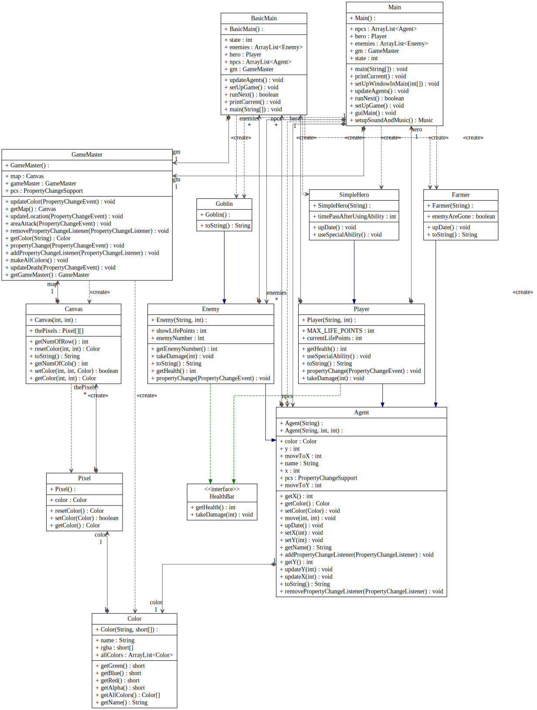

# CSCD 212 S22 Lab 3 (Observer Design Pattern)

> Note: We now use Property Change in Java for Observer as Observer in Java is deprecated

Story: 
> "Fun Game Company" has hired you back on as a contractor for their upcoming hit videogame, "First RPG". Their inhouse team has been working furiously on the project since your last contribution, and with the help of your work, now have well-tested, cutting edge graphics.
> Your new task is to increase immersion and interactivity by creating a sequence of observers and listeners to respond to in-game events, like exploration and intense Player V.s. Enemy combat. The team has provided a simple prototype level that auto-plays if you click through it, which can help you determine if your task in complete.

What it will look like at the end of this Lab


> Note: that Unit Tests in GitHub most of the time does not work

Need to be done
- [ ] add `extends PropertyChangeListener` to HealthBar
- GameMaster
- [ ] add `implements PropertyChangeListener` to GameMaster
- [ ] add `PropertyChangeSupport` (pcs) to GameMaster
- [ ] When "area attack" propertyName run `areaAttack` (in GameMaster)
- [ ] When "location" propertyName run `updateLocation` (in GameMaster)
- [ ] When "dead" propertyName run `updateDeath` (in GameMaster)
- [ ] When "color change" propertyName run `updateColor` (in GameMaster)
- [ ] Pass PropertyChangeEvent to `areaAttack`, `updateLocation`, `updateDeath`, `updateColor`
- [ ] In updateDeath get xAndY from event new value (in GameMaster)
- [ ] In updateDeath remove listener when it a listener (in GameMaster)
- [ ] In updateColor get x, get y and get color from source (agent) (in GameMaster)
- [ ] In updateLocation get agent (source), get oldXAndY (old value), get xAndY (new value) (in GameMaster)
- [ ] Make `areaAttack` to `firePropertyChange` with "take damage" and newValue `int[]` with \[damage, x, y\] (in GameMaster)
- [ ] Make `addPropertyChangeListener` and `removePropertyChangeListener` (in GameMaster)
- Agent
- [ ] add `protected PropertyChangeSupport` to Agent
- [ ] `firePropertyChange` in setColor with "color change"
- [ ] updateX and update& `firePropertyChange` with "location" and old `int[]` oldx and y and new `int[]` x and y
- [ ] Make `addPropertyChangeListener` and `removePropertyChangeListener` (in Agent)
- Enemy
- [ ] implements the new HealthBar
- [ ] when "take damage" use this code
```java
double distance = Math.sqrt(Math.pow((this.getX()-data[1]), 2) + Math.pow((this.getY()-data[2]), 2));
if (distance < 4) {
    this.takeDamage(data[0]);
}
```
- [ ] in takeDamage `firePropertyChange` when dead
- Player
- [ ] implements the new HealthBar
- [ ] when "take damage" use this code
```java
double distance = Math.sqrt(Math.pow((this.getX()-data[1]), 2) + Math.pow((this.getY()-data[2]), 2));
if (distance < 4) {
    this.takeDamage(data[0]);
}
```
- [ ] in takeDamage `firePropertyChange` when dead
- SimpleHero
- [ ] `firePropertyChange` with name "area attack" and damage 15

## Here is some notes that may help

[About Observer](https://refactoring.guru/design-patterns/observer)

[The use of Observer and Observable in this lab](ObserverAndObservable.md)

[UML for This](cscd212-s22-lab3-uml.png)